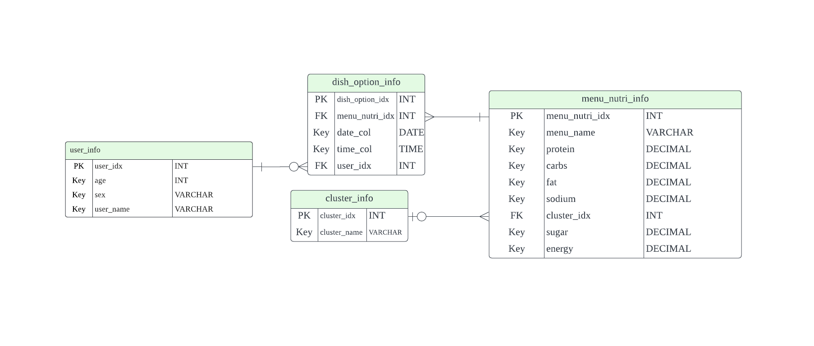

## :pushpin: Intro
>머신러닝과 CNN을 활용하여 이미지 분류 및 영양소 분석을 통한 반찬 예측 및 메뉴 추천 시스템 (팀 프로젝트)   
>목적 : 영양 불균형 문제를 해결하기 위한CNN 기반 반찬 예측과 메뉴 추천 시스템 개발  
>동기 : 1인 가구의 식단 문제 해결 및 개인의 건강촉진,영양 문제에 대한 인식과 관심 상승  
>URL   

---

## 1. Project Period & Role
>제작 기간: 2023.06.20 ~ 2023.07.12   

---

#### `김도연`
>이메일: doyeon7507@gmail.com 
>깃헙: https://github.com/kmdn998 
>프런트엔드 
>기능구현 

#### `김정숙`
>이메일: js-kim20@naver.com 
>깃헙: https://github.com/rlajs 
>반찬예측알고리즘 
>연관분석 

#### `김호탁`
>이메일: katohmik@gmail.com 
>깃헙: https://github.com/katohmik 
>저녁추천알고리즘 
>군집분석 

#### `이준규`
>이메일: ljk9707@naver.com 
>깃헙: https://github.com/kkyukkyu99 
>저녁추천알고리즘 
>연관분석 및 연관분석 결과 통합 

#### `장상윤`
>이메일: jangapp21@gmail.com 
>깃헙: https://github.com/jangsangyoon13/ 
>백엔드 
>DB설계 

#### `정구열`
>이메일: yeol512@nate.com 
>깃헙: https://github.com/zzang910/ 
>프런트엔드 
>화면설계 

#### `한태성`
>이메일: hantaeseong4@naver.com 
>깃헙: https://github.com/hantaeseong00/ 
>팀장 
>총괄 

---

## 2. Development Environment & Utilized Skils
#### `Development Environment(Back-End)`
>Python 3.9.13 
>Ubuntu 20.04.6 LTS  
>Intel(R) Xeon(R) CPU @ 2.00GHz 
>RAM:13294264 
>NVIDIA-SMI 525.85.12 
>CUDA Version: 12.0 

---

#### `Development Environment(Front-End)`
>
>
>
>
>

---

#### `Utilized  Skils`
>데이터 분석 라이브러리    
	- pandas, numpy    
	- tensorflow    
	- google.colab    
	- apriori, fpgrowth    
	- K-Means, DBSCAN    
	
>웹 크롤링 라이브러리    
	- Beautiful Soup, Selenium,	Requests    
	
>시각화 
	- matplotlib, seaborn    
	
>통계 및 분석 기법    
	- CNN    
	- 연관 분석    
	- 군집 분석    

---

## :pushpin: Projects
## 1. 개요
>본 프로젝트는 1인 가구의 영양 불균형 문제를 해결하기 위해 이미지 분석을 활용하여 반찬 예측과 메뉴 추천 시스템을 개발하는 것을 목표로 합니다. 
>연관분석을 통해 한끼 식단과 점심-저녁 메뉴 추천 기능을 구현하여 개인의 영양 균형 개선과 식단 다양성을 증가시킵니다. 
>이를 통해 건강한 식습관 형성을 지원합니다. 

---

## 2. Expected Results
>영양 균형 개선, 식단 다양성 증가
>개인 건강 관리 강화, 영양 문제 인식 증진 및 사회적 영향의 증대
>영양 균형을 갖춘 맞춤형 식단을 구성하고 건강한 식습관을 형성
>사회적으로도 건강한 식습관을 확산

---

## 3. 배경

>김성아 등 4인,『서울시민 만성질환 실태와 식생활 위험요인 분석』, 서울연구원(2022)   
>
>...
>...
>...
>...

---

## 4. Project Architecture

---

## 5. ERD

---

## 6. Project Result & Visualization
>
>개발 기간: 2023.06.20 ~ 2023.07.12
>  
>기술 스택:  
>Python
>  
>[1. Image Classification](https://github.com/hantaeseong00/Acorn_Final_Proj/tree/main/Source%20Code/1.%20Image%20Classification) 참고   
>[2. Side Dish Prediction](https://github.com/hantaeseong00/Acorn_Final_Proj/tree/main/Source%20Code/2.%20Side%20Dish%20Prediction) 참고   
>[3. Dinner Recommendation](https://github.com/hantaeseong00/Acorn_Final_Proj/tree/main/Source%20Code/3.%20Dinner%20Recommendation) 참고   
>[4. Prototype Development](https://github.com/hantaeseong00/Acorn_Final_Proj/tree/main/Source%20Code/3.%20Dinner%20Recommendation) 참고   

---

### [6.1. Image Classification](https://github.com/hantaeseong00/Acorn_Final_Proj/tree/main/Source%20Code/1.%20Image%20Classification)

#### `Transfer Learning Model(MobileNet) Fine-Tuning Visualization`

| Model | Hidden Layer | Dense Count | Learning Rate | Accuracy | Learning Time(ms) | 
| :-- | :-: | :-: | :-: | :-: | :-: |
| **Basic** | 3 | 1024 | 2e-5 | 94.88% | 26376814 |
|  |  |  |  |  |  |
| **Change dense value to 2048** | 3 | 2048 | 2e-5 | 95.20% | 25686338 |
| **Change dense value to 4098** | 3 | **4096** | 2e-5 | 95.23% | 25535377 |
|  |  |  |  |  |  |
| **Change the number of hidden layers to 2** | **2** | 1024 | 2e-5 | 95.20% | 20395924 |
| **Change the number of hidden layers to 4** | **4** | 1024 | 2e-5 | **93.65%** | **20511320** |
|  |  |  |  |  |  |
| **Change learning rate value to 5e-5** | 3 | 1024 | 5e-5 | 95.37% | 23425362 |
| **Change learning rate value to 2e-4** | 3 | 1024 | **2e-4** | **96.54%** | **28082135** |
   
>덴스 수가 증가함에 따라 정확도가 증가하는 경향을 관찰할 수 있었습니다.    
>히든 레이어의 수가 증가함에 따라 정확도가 감소하는 경향을 관찰하였습니다.     
>러닝 레이트가 증가함에 따라 정확도가 증가하는 경향을 관찰할 수 있었습니다.    

---

### [6.2. Side Dish Prediction](https://github.com/hantaeseong00/Acorn_Final_Proj/tree/main/Source%20Code/2.%20Side%20Dish%20Prediction)

#### `Comparison of Apriori and FP-Growth Models.`
|  | **Apriori** | **FP-Growth** |
| :-- | :-- | :-- |
| **기본 개념** | 빈발 아이템 집합(frequent itemset)을 탐색하는 방법 | 아이템 집합을 압축하여 트리 형태로 구성하는 방법 |
| **아이템 집합 탐색 방법** | **가능한 모든 아이템 조합**을 검사하여 빈발 아이템 집합을 생성 | **FP-트리**를 구축하여 빈발 아이템 집합을 생성 |
| **장점** | 	- **직관적**이고 **이해하기 쉬운** 알고리즘 | - Apriori보다 **효율적인 메모리** 사용 |
|  | - 이론적으로는 **모든 가능한 연관 규칙**을 탐색 | - Apriori보다 더 **빠른 속도**로 빈발 아이템 집합을 생성 |
|  | - 알고리즘에 의해 생성된 빈발 아이템 집합은 동일하다 | - 빈발 아이템 집합을 압축하여 **메모리 사용량을 줄임** |
| **단점** | 	- **큰 데이터셋**에 대해서는 **성능이 떨어질 수 있음** | - 알고리즘 이해 및 구현이 **복잡**할 수 있음 |
|  | 	- 후보 아이템 집합 생성과정에서 **비효율적**일 수 있음 |  |	

---

#### `Comparison of Confidence and Conviction.`
|  | **Confidence(신뢰도)** | **Conviction(확신도)** |
| :-- | :-- | :-- |
| **정의** | 조건부 확률로서, 조건 아이템이 주어졌을 때 결과 아이템이 발생할 확률 | 규칙의 신뢰도에 대한 척도로서, 조건 아이템이 주어졌을 때 결과 아이템이 발생하는 빈도를 랜덤 모델의 예측 빈도로 나눈 값 |
| **계산 방법** | (조건 아이템과 결과 아이템이 동시에 발생하는 빈도) / (조건 아이템이 발생하는 빈도) | (1 - Support(결과 아이템의 지지도)) / (1 - Confidence(규칙의 신뢰도)) |
| **범위** | 	0부터 1까지의 값 | 0부터 무한대의 양수 값 |
| **해석** | 조건 아이템이 발생할 때 결과 아이템이 발생할 확률을 백분율로 나타냄 | 조건 아이템과 결과 아이템이 독립적일 때의 예상되는 발생 빈도로서, 1보다 크면 의존성이 강함 |
| **활용** | 규칙의 **강도**와 **신뢰성**을 평가함 | 규칙의 **예측력**과 **독립성**을 평가함 |
| **관련성 분석 방향** | 조건 아이템에서 결과 아이템으로의 관련성을 분석함 | 결과 아이템에서 조건 아이템으로의 관련성을 분석함 |
| **값의 해석** | 값이 높을수록 조건 아이템과 결과 아이템 간의 **관련성**이 높음 | 값이 1에 가까울수록 조건 아이템과 결과 아이템 간의 **독립성**이 높음 |
| **결합한 규칙의 평가에 활용** | 조건 아이템과 결과 아이템 간의 강한 **관련성**을 가진 규칙을 선택함 | 조건 아이템과 결과 아이템 간의 **독립성**을 가진 규칙을 선택함 |
	
---

#### `Side Dish Prediction Algorithm Visualization`

---

### [6.3. Dinner Recommendation](https://github.com/hantaeseong00/Acorn_Final_Proj/tree/main/Source%20Code/3.%20Dinner%20Recommendation)
	
#### `Dinner Recommendation Algorithm Visualization`

---

### [6.4. Prototype Development](https://github.com/hantaeseong00/Acorn_Final_Proj/tree/main/Source%20Code/3.%20Dinner%20Recommendation)

---

## 7. Limitations and Compensation Points

#### `영양 불균형 관련 통계 분석 부재`
>프로젝트에서는 영양 불균형에 대한 통계 분석을 진행하지 못한 점이 아쉬웠습니다.  
>이를 통해 더 깊이 있는 분석과 인사이트를 도출할 수 있었을 것입니다. 
	
#### `데이터 신뢰성 및 검수 과정`
>수집한 데이터와 이미지의 신뢰성이 낮아 사람이 직접 검수해야 하는 필요성과 많은 시간이 소요되는 문제가 있었습니다.  
>데이터 전처리 과정에서 너무 많은 시간이 소요되어 효율성이 저하되었습니다.  
>이를 개선하여 데이터의 신뢰성을 높이고 검수 과정을 자동화해야 합니다. 
	
#### `이미지 분류 카테고리 감소`
>데이터 신뢰성 문제로 인해 이미지 분류를 위한 카테고리 수가 줄어든 점이 아쉽습니다.  
>신뢰성 있는 데이터 수집과 더 다양한 카테고리를 포함하여 정확한 이미지 분류를 이루어야 합니다. 
	
#### `전이학습 모델 및 YOLO와의 비교 미진행`
>다양한 전이학습 모델과 객체 탐지 모델인 YOLO와의 비교를 진행하지 못한 점이 아쉽습니다.  
>이를 통해 다른 모델의 성능과 효과를 평가하고 최적의 모델을 선택할 수 있었을 것입니다. 
	
#### `식단 데이터 한정성`
>식단 데이터가 고등학교 급식 데이터로 한정되어 실제 사용자의 식단과는 차이가 있을 수 있다는 점을 인지하고 있습니다.  
>실제 사용자의 행태 데이터를 수집하여 식단 추천 시스템의 정확도를 향상시켜야 합니다. 
	
#### `연관 분석 결과 시각화 미진행`
>연관 분석 결과의 시각화를 진행하지 못한 점이 아쉽습니다. 
>이를 통해 연관 분석의 신뢰도와 해석력을 높일 수 있었을 것입니다. 
	
#### `군집 분석 시각화 제약`
>군집 분석에서 6차원 데이터를 효과적으로 시각화하지 못해 3차원으로만 제한된 점이 아쉽습니다.  
>더 다양한 시각화 방법과 차원 축소 기법을 활용하여 분석 결과를 명확하게 시각화해야 합니다. 
	
#### `Conclusion`
>프로젝트 진행 과정에서 어려움을 겪었지만, 이를 통해 성장할 수 있었습니다. 
>계속해서 발전하고 더 나은 결과물을 제공하기 위해 노력할 것입니다. 
>한계점을 인식하고 향후 과제에 대한 계획을 세움으로써, 우리는 더 나은 프로젝트를 구현하고자 합니다. 
	
---

## 8. Reference
