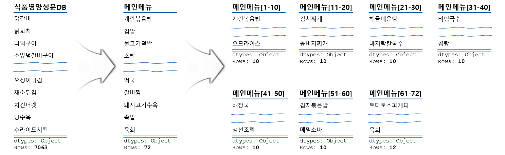
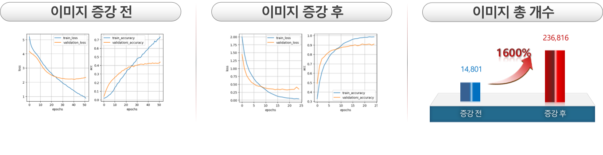
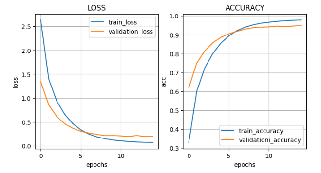
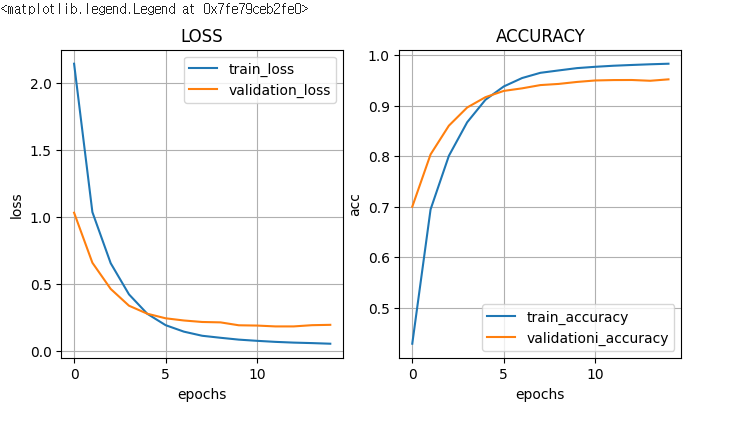
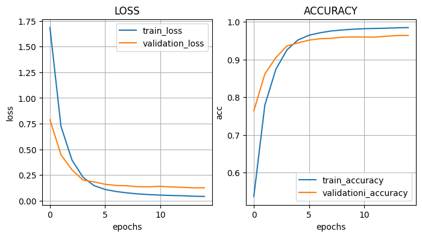
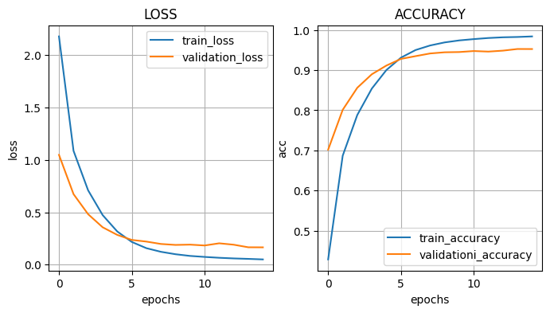
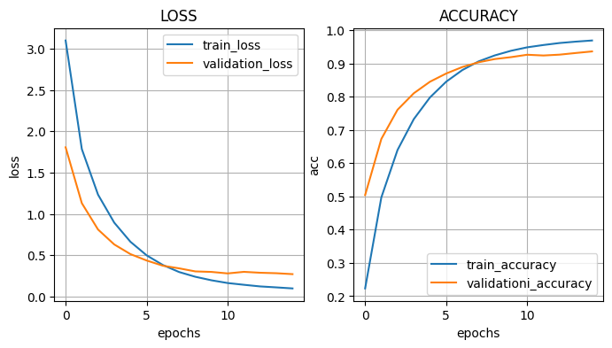
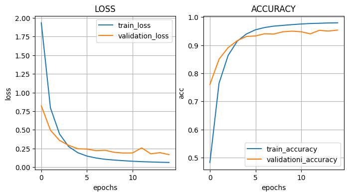
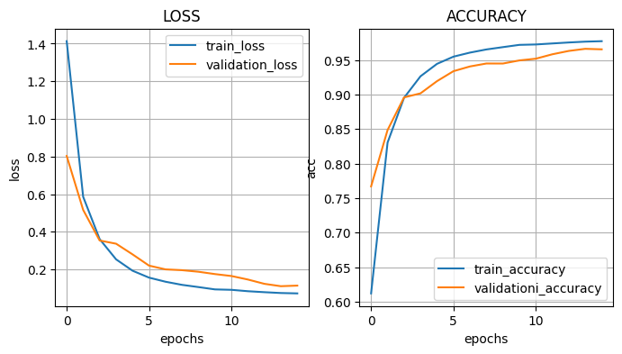
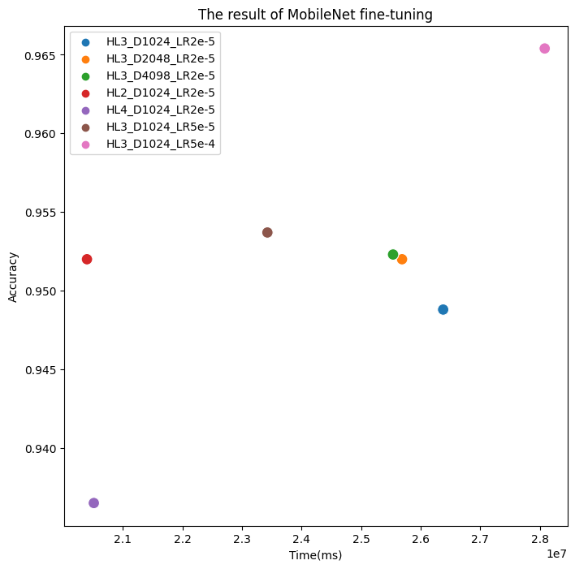

# :pushpin: Image Classification
>MobileNet 전이학습 모델을 활용한 음식 이미지 데이터 분류에 적합한 Fine-Tuning.

 

---

## 1. 소스코드(Colab)
- [MobileNet - F - D(1024) - D(1024) - D(1024)](https://colab.research.google.com/drive/1FOb6jYRPHf9WfLKtwmKr4e6N2yf1nPkA#scrollTo=Cime78Orz_sI)
- [MobileNet - F - D(2048) - D(2048) - D(2048)](https://colab.research.google.com/drive/1JgyoIV4XvudjFiwJsvA3oxuAcj5zXgpx?usp=sharing)
- [MobileNet - F - D(4098) - D(4098) - D(4098)](https://colab.research.google.com/drive/1L6PIqXr90Z5dmQ6rOFfv8pmAqIsb8Zs5#scrollTo=YYHdRwx4S1Is)
- [MobileNet - F - D(1024) - D(1024)](https://colab.research.google.com/drive/1DAGr0S-HszSMFu0DPSopjLYLkABPOdCb?usp=sharing)
- [MobileNet - F - D(1024) - D(1024) - D(1024) - D(1024)](https://colab.research.google.com/drive/1KO6Y9pTuAUdZbjHawuVbdKs59URhUnx7?usp=sharing)
- [MobileNet - F - D(1024) - D(1024) - D(1024)](https://colab.research.google.com/drive/1L6PIqXr90Z5dmQ6rOFfv8pmAqIsb8Zs5#scrollTo=YYHdRwx4S1Is)
- [MobileNet - F - D(1024) - D(1024) - D(1024)](https://colab.research.google.com/drive/1L6PIqXr90Z5dmQ6rOFfv8pmAqIsb8Zs5#scrollTo=YYHdRwx4S1Is)

 

---

## 2. 데이터 수집 및 전처리

### 2.1. 데이터 수집

#### `음식 카테고리`

>[식품영양성분DB(식품안전나라)](https://various.foodsafetykorea.go.kr/nutrient/)    

---

#### `음식 이미지`

>[만개의 레시피](https://www.10000recipe.com/) 
>[네이버 지도](https://map.naver.com/v5/entry/place)    

---

#### `전처리(1차)`

---

#### `전처리(2차)`

---

#### `전처리(3차)`

---

#### `이미지 증강`

---

## 2. MobileNet 기본 세팅
- weight: imagenet
- Dropout: 0.5
- optimizer: Adam

 

### 2.1. Basic
- Model Architecture: MobileNet - F - D(1024) - D(1024) - D(1024)
- Learning Rate: 2e-5

- Accuracy : 0.9488
- Learning Time : 26376814.830 ms
 

### 2.2. Change dense value to 2048
- Model Architecture: MobileNet - F - D(2048) - D(2048) - D(2048)
- Learning Rate: 2e-5

- Accuracy : 0.9520
- Learning Time : 25686338.559 ms

 

### 2.3. Change dense value to 4098
- Model Architecture: MobileNet - F - D(4098) - D(4098) - D(4098)
- Learning Rate: 2e-5

- Accuracy : 0.9523
- Learning Time : 25535377.915 ms

 

### 2.4. Change the number of hidden layers to 2
- Model Architecture: MobileNet - F - D(1024) - D(1024)
- Learning Rate: 2e-5

- Accuracy : 0.9520
- Learning Time : 20395924.553 ms

 

### 2.5. Change the number of hidden layers to 4
- Model Architecture: MobileNet - F - D(1024) - D(1024) - D(1024) - D(1024)
- Learning Rate: 2e-5

- Accuracy : 0.9365
- Learning Time : 20511320.952 ms

 

### 2.6. Change learning rate value to 5e-5
- Model Architecture: MobileNet - F - D(1024) - D(1024) - D(1024)
- Learning Rate: 5e-5

- Accuracy : 0.9537
- Learning Time : 23425362.471 ms

 

### 2.7. Change learning rate value to 2e-4
- Model Architecture: MobileNet - F - D(1024) - D(1024) - D(1024)
- Learning Rate: 2e-4

- Accuracy : 0.9654
- Learning Time : 28082135.071 ms

 

## 3. The result of MobileNet fine-tuning

| Model | Hidden Layer | Dense Count | Learning Rate | Accuracy | Learning Time(ms) | 
| :-- | :-: | :-: | :-: | :-: | :-: |
| **mn_resultset1** | 3 | 1024 | 2e-5 | 94.88% | 26376814 |
|  |  |  |  |  |  |
| **mn_resultset2** | 3 | 2048 | 2e-5 | 95.20% | 25686338 |
| **mn_resultset3** | 3 | **4096** | 2e-5 | 95.23% | 25535377 |
|  |  |  |  |  |  |
| **mn_resultset4** | **2** | 1024 | 2e-5 | 95.20% | 20395924 |
| **mn_resultset5** | **4** | 1024 | 2e-5 | **93.65%** | **20511320** |
|  |  |  |  |  |  |
| **mn_resultset6** | 3 | 1024 | 5e-5 | 95.37% | 23425362 |
| **mn_resultset7** | 3 | 1024 | **2e-4** | **96.54%** | **28082135** |

 

## 4. Reflection

- 덴스 수 증가와 정확도
	- 덴스 수는 신경망의 은닉층에서의 뉴런 수를 의미합니다.
	- 실험 결과를 분석한 결과, 덴스 수가 증가함에 따라 정확도가 증가하는 경향을 관찰할 수 있었습니다.
	- 이는 뉴런 수가 증가함으로써 모델이 더 많은 특징을 학습하고 복잡한 패턴을 인식할 수 있게 되었기 때문으로 해석됩니다.

- 히든 레이어와 정확도
	- 히든 레이어는 신경망에서 입력층과 출력층 사이의 은닉층을 의미합니다. 
	- 실험 결과에 따르면, 히든 레이어의 수가 증가함에 따라 정확도가 감소하는 경향을 관찰하였습니다. 
	- 이는 히든 레이어의 수가 증가하면 모델의 복잡도가 증가하고, 과적합(overfitting) 현상이 발생하여 훈련 데이터에 대한 정확도는 높아지지만 실제 데이터에 대한 일반화 능력은 저하되었기 때문으로 추론할 수 있습니다.

- 러닝 레이트와 정확도
	- 러닝 레이트는 신경망의 가중치를 업데이트할 때 적용되는 학습 속도를 나타냅니다. 
	- 실험 결과를 분석한 결과, 러닝 레이트가 증가함에 따라 정확도가 증가하는 경향을 관찰할 수 있었습니다. 
	- 이는 러닝 레이트의 증가로 인해 모델이 빠르게 수렴하고, 최적의 가중치를 찾는 데에 더 효율적으로 수행되었기 때문으로 판단됩니다.

- 학습 시간의 불규칙성
	- 학습 시간의 차이는 서로 다른 계정으로 학습시킨 결과에 의해 발생한 문제로 해석됩니다. 
	- 서로 다른 계정으로 학습을 진행할 경우, 하드웨어 성능, 네트워크 상태, 데이터 처리 속도 등 다양한 요인에 의해 학습 시간에 차이가 발생할 수 있습니다.
	- 이러한 차이로 인해 모델의 성능 평가에 영향을 미칠 수 있으므로, 학습 시간의 일관성을 유지하는 것이 중요하합니다. 
	- 학습 시간의 일관성을 유지하기 위해서는 동일한 환경에서 학습을 수행하거나 하드웨어 성능 및 네트워크 상태 등을 동등하게 조정하는 것이 필요합니다. 
	- 이러한 문제는 신뢰할 수 있는 실험 결과를 얻기 위해서는 중요한 요소로 고려되어야 합니다.

- 결론
	- 이러한 고찰을 통해 덴스 수, 히든 레이어 수, 러닝 레이트와 모델의 성능 간의 상관 관계를 파악할 수 있었습니다. 
	- 따라서 이러한 요소들을 조정하면서 모델의 성능을 향상시킬 수 있는 방향으로 개선 작업을 진행할 수 있습니다.