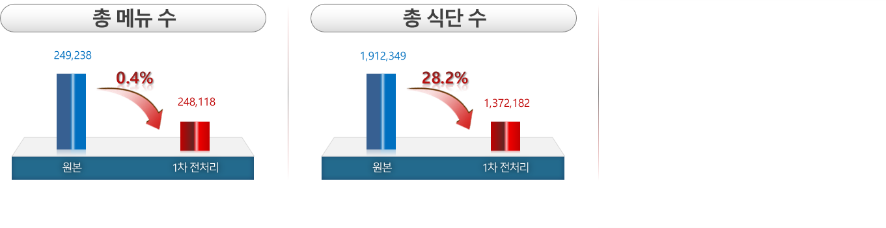
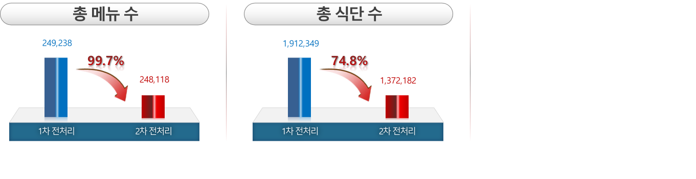

# :pushpin: Side Menu Prediction
>고퀄리티 개발 컨텐츠 공유 서비스  
>https://go-quality.dev  
# :pushpin: Side Menu Prediction
>이미지 분류 알고리즘을 통해 추정된 음식을 기반으로 FP-Growth 모델을 활용한 반찬 예측 알고리즘

---

## 1. 데이터 수집 및 전처리

### 1.1. 데이터 수집

#### `식단 데이터`

>[우리학교급식식단(식품안전나라)](https://foodsafetykorea.go.kr/portal/sensuousmenu/schoolMealsDetail.do)    

| **컬럼명** | **타입** | **설명** |
| :-- | :-- | :-- |
| sch_nm | Object | 고등학교명(총 2660개) |
| menu_date | datetime | 식단제공일자(2019년-2023년) |
| dt | Object | 중식 또는 석식 |
| menu | Object | 식단 정보 (Ex. 기장밥 세발나물(자율) 물미역/초고추장(자율) ... |

>대략 190만개의 식단 데이터 수집 

### 1.2. 전처리(1차)

|  | **원본** | **1차 전처리** |
| :-- | :-- | :-- |
| **메뉴수** | 249,238 | 248,118 |
| **식단수** | 1,912,349 | 1,372,182 |
| **비고** |  | - 오타 |
|  |  | - 과도하게 세분화된 메뉴명 |
|  |  | - 창의적인 메뉴명 |

### 1.2. 전처리(2차)

|  | **1차 전처리** | **2차 전처리** |
| :-- | :-- | :-- |
| **메뉴수** | 248,118 | 712 |
| **식단수** | 1,372,182 | 345,703 |
| **비고** |  | - 식품영양성분DB의 메뉴명과 매칭 |
|  |  | - 전처리 후, 3개 미만의 메뉴로 구성된 식단 제외 |

## 2. Association Rules

### 2.1. 1차 학습 결과

#### `Comparison of Apriori and FP-Growth Models.`

|  | **Apriori** | **FP-Growth** |
| :-- | :-- | :-- |
| **기본 개념** | 빈발 아이템 집합(frequent itemset)을 탐색하는 방법 | 아이템 집합을 압축하여 트리 형태로 구성하는 방법 |
| **아이템 집합 탐색 방법** | **가능한 모든 아이템 조합**을 검사하여 빈발 아이템 집합을 생성 | **FP-트리**를 구축하여 빈발 아이템 집합을 생성 |
| **장점** | 	- **직관적**이고 **이해하기 쉬운** 알고리즘 | - Apriori보다 **효율적인 메모리** 사용 |
|  | - 이론적으로는 **모든 가능한 연관 규칙**을 탐색 | - Apriori보다 더 **빠른 속도**로 빈발 아이템 집합을 생성 |
|  | - 알고리즘에 의해 생성된 빈발 아이템 집합은 동일하다 | - 빈발 아이템 집합을 압축하여 **메모리 사용량을 줄임** |
| **단점** | 	- **큰 데이터셋**에 대해서는 **성능이 떨어질 수 있음** | - 알고리즘 이해 및 구현이 **복잡**할 수 있음 |
|  | 	- 후보 아이템 집합 생성과정에서 **비효율적**일 수 있음 |  |	

>연관성 있는 반찬들이 추천되었지만, 모든 메뉴에서 높은 점수로 추천되는 반찬들이 여전히 존재하는 것을 확인했습니다. 
>결정측도로 사용한 신뢰도가 반찬의 빈도수에 큰 영향을 받아 발생한 문제였습니다. 
>이에 저희는 신뢰도 대신 독립성까지 고려하는 결정측도인 컨빅션을 사용하기로 결정했습니다. 

---

### 2.2. 2차 학습 결과

#### `Comparison of Confidence and Conviction.`

|  | **Confidence(신뢰도)** | **Conviction(확신도)** |
| :-- | :-- | :-- |
| **정의** | 조건부 확률로서, 조건 아이템이 주어졌을 때 결과 아이템이 발생할 확률 | 규칙의 신뢰도에 대한 척도로서, 조건 아이템이 주어졌을 때 결과 아이템이 발생하는 빈도를 랜덤 모델의 예측 빈도로 나눈 값 |
| **계산 방법** | (조건 아이템과 결과 아이템이 동시에 발생하는 빈도) / (조건 아이템이 발생하는 빈도) | (1 - Support(결과 아이템의 지지도)) / (1 - Confidence(규칙의 신뢰도)) |
| **범위** | 	0부터 1까지의 값 | 0부터 무한대의 양수 값 |
| **해석** | 조건 아이템이 발생할 때 결과 아이템이 발생할 확률을 백분율로 나타냄 | 조건 아이템과 결과 아이템이 독립적일 때의 예상되는 발생 빈도로서, 1보다 크면 의존성이 강함 |
| **활용** | 규칙의 **강도**와 **신뢰성**을 평가함 | 규칙의 **예측력**과 **독립성**을 평가함 |
| **관련성 분석 방향** | 조건 아이템에서 결과 아이템으로의 관련성을 분석함 | 결과 아이템에서 조건 아이템으로의 관련성을 분석함 |
| **값의 해석** | 값이 높을수록 조건 아이템과 결과 아이템 간의 **관련성**이 높음 | 값이 1에 가까울수록 조건 아이템과 결과 아이템 간의 **독립성**이 높음 |
| **결합한 규칙의 평가에 활용** | 조건 아이템과 결과 아이템 간의 강한 **관련성**을 가진 규칙을 선택함 | 조건 아이템과 결과 아이템 간의 **독립성**을 가진 규칙을 선택함 |
   

>컨빅션을 사용한 최종 학습 결과로는 키워드(음식명)와 관련성이 높은 반찬이 추천되는 결과를 얻을 수 있었습니다.
---