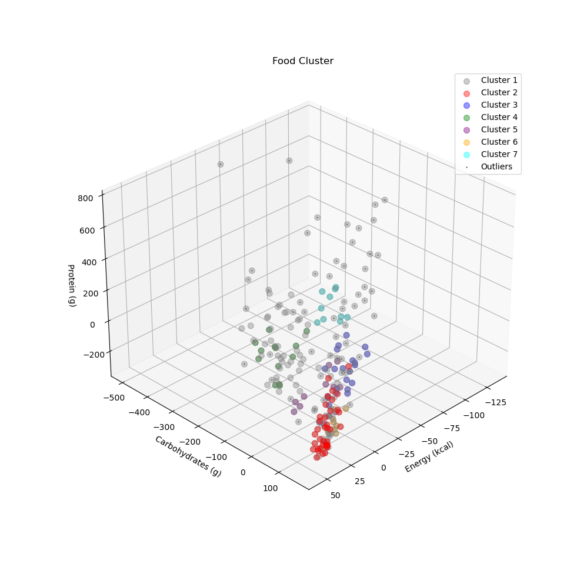

# :pushpin: Dinner Recommendation
>이미지 분류 알고리즘을 통해 추정된 음식과 반찬 예측 알고리즘을 통해 예측된 반찬을 기반으로 FP-Growth 모델과 DBSCAN모델을 활용한 저녁 추천 알고리즘

---

## 1. 데이터 수집 및 전처리

### 1.1. 데이터 수집

#### `1일 영양소 권장 섭취량 데이터`

| **컬럼명** | **타입** | **설명** |
| :-- | :-- | :-- |
| 성별 | Object | 남자 또는 여자 |
| 연령대 | Object | 6-8, 9-11, 12-14, 15-18, 19-29, 30-49, 50-64, 65-74, 75이상 |
| 에너지 | float | Kcal |
| 탄수화물 | float | g |
| 단백질 | float | g |
| 나트륨 | float | g |

---

### 1.2. 전처리

#### `1일 영양소 권장 섭취량 데이터의 파생변수(지방, 당) 추가`

|  | **원본** | **전처리** |
| :-- | :-- | :-- |
| **컬럼수** | 6 | 8 |
| **비고** |  | - 파생변수(지방, 당) 추가 |

#### `식품영양성분DB 차원 축소 및 메인메뉴 추출` 
<!-- (메뉴명, 에너지, 탄수화물, 단백질, 지방, 나트륨, 당) -->

|  | **원본** | **전처리** |
| :-- | :-- | :-- |
| **컬럼수** | 100 | 8 |
| **메뉴수** | 7,704 | 218 |
| **비고** |  | - 메뉴명, 에너지, 탄수화물, 단백질, 지방, 나트륨, 당 |
|  |  | - 파생변수(군집명) 추가 |
|  |  | - 기본 **밥** 및 **반찬** 또는 **제과제빵**으로 보이는 메뉴 **제외** |

---

## 2. Cluster Analysis

#### `Residual Nutrient Calculation`

|  | **1일 영양소 권잡 섭취량** | **취식 영양소** | **잔여 영양소** |
| :-- | :-- | :-- | :-- |
| **에너지** | 2507.11 | 1500.0 | **1007.11** |
| **탄수화물** | 261.39 | 130.0 | **131.39** |
| **단백질** | 134.74 | 50.0 | **84.74** |
| **지방** | 102.56 | 50.0 | **52.56** |
| **당** | 43.42 | 37.5 | **5.92** |
| **나트륨** | 6.49 | 2.0 | **4.49** |

#### `Comparison of K-Means and DBSCAN`

|  | **K-Means** | **FP-Growth** |
| :-- | :-- | :-- |
| **기본 개념** | 중심 기반으로 군집을 형성하는 방법 | 밀도를 기준으로 군집을 형성하는 방법 |
| **군집 모양** | 원형 군집에 더 적합 | 임의의 모양을 가진 군집에 더 적합 |
| **하이퍼파라미터** | 클러스터 개수(k) | 최소 이웃 거리(eps), 최소 이웃 개수(min_samples)  |
| **클러스터 수** | 클러스터 수를 사전에 알고 있어야 함 | 자동으로 클러스터 수를 결정함 |
| **장점** | - 간단하고 직관적인 알고리즘 | - 데이터의 분포에 따라 임의의 모양과 크기의 군집을 찾을 수 있음 |
|  | - 대용량 데이터에도 효율적으로 처리 가능 | - 클러스터의 개수를 사전에 알 필요 없이 자동으로 결정됨 |
|  | - 수렴 속도가 빠름 | - 이상치에 강건함 |
|  | - 원형 군집에 적합 | - 밀도 기반으로 군집을 찾기 때문에 밀집된 영역에 강건함 |
| **단점** | - 초기 중심점의 선택에 따라 결과가 달라질 수 있음 | - 밀집도 파라미터에 민감하며 적절한 파라미터 설정이 필요함 |
|  | - 이상치에 민감함 | 고차원 데이터에 대한 성능이 떨어질 수 있음 |	
|  | - 클러스터의 개수(k)를 미리 정해야 함 |  |	
|  | - 임의의 모양과 크기를 가진 군집에 적합하지 않음 |  |	
   
>잔여 영양소를 계산하여 중심 데이터와의 차이를 통해 거리 계산을 하는 방식 채택하였습니다.    
>따라서 군집의 모양이 정해져 있지 않고, 밀도를 기준으로 군집을 형성하는 DBSCAN방식이 더 적합하다고 판단하였습니다.     

### 2.1. 학습 결과

#### `Fine-tuning`

